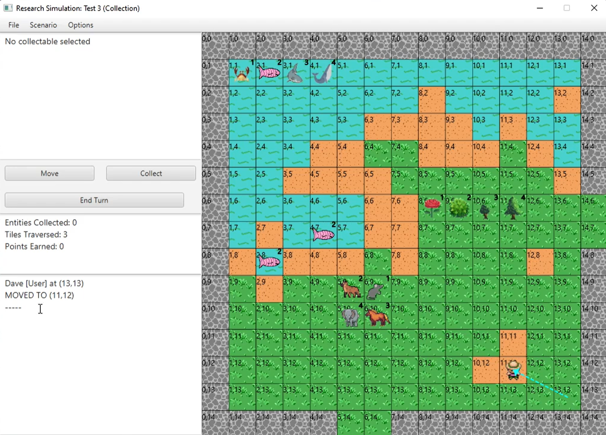

# 2D-grid Inhabitant Hunter game

This program is the JAVA implementation of a simple simulation of a researcher exploring an interactable scenario. The simulation allows the user to navigate an environment and collect research on its inhabitants. A primary class in this simulation is the Scenario. A scenario is used to maintain a record of all inhabitants of an environment. The scenario also maintains a record of all movements and interactions between the scenario’s inhabitants. Scenarios loaded into the simulation are kept track of using a singleton scenario manager.

## View the document

The document is located at ./docs/index.html

## Run the program

run ./src/Launcher.java

A similar interface will be shown as below:

